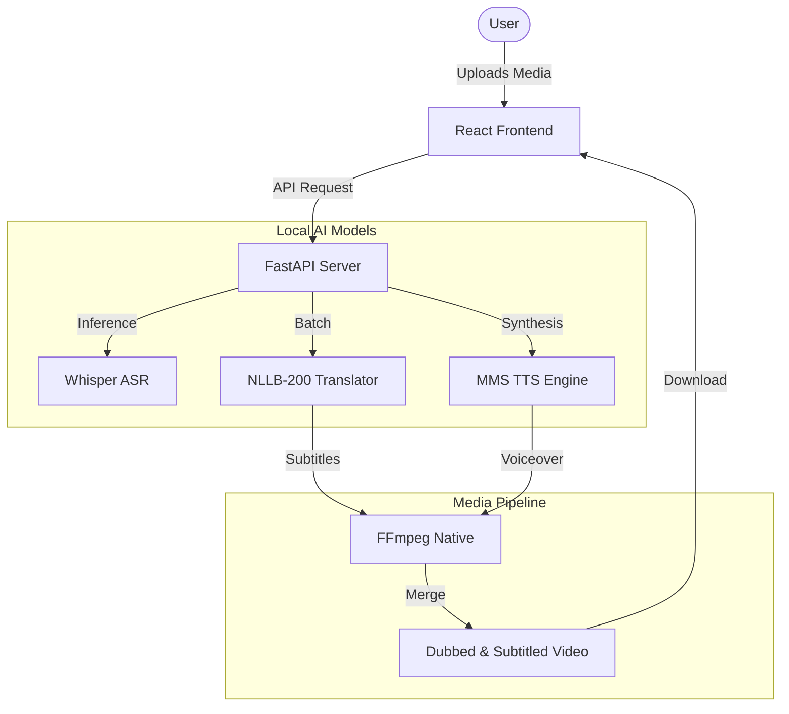

# 🌾 BIAF-offASR: Offline Translation Portal

[](https://github.com/froster02/BIAF-offASR)
[](https://github.com/froster02/BIAF-offASR)
[](https://github.com/froster02/BIAF-offASR/blob/main/LICENSE)
[](SECURITY.md)

A local-first, zero-network platform built to process translation, subtitling, and voice dubbing for agricultural and rural development. Supporting **Hindi**, **Marathi**, and **English**, it is designed for field officers working in areas with limited or no connectivity.

---

## 📸 Aesthetic & Vision
The portal features a **refined editorial-rural UI**—a unique blend of characterful serif typography (**Alegreya**) and high-legibility sans-serif (**Hind**), paired with a deep agricultural green palette. It moves away from generic "AI" aesthetics to provide a tactile, grounded experience for rural development professionals.


---

## 💡 Key Capabilities

1.  **Offline Text Translation**: Instant translation between English, Hindi, and Marathi using optimized Seq2Seq models.
2.  **Speech-to-Text (ASR)**: Transcribe audio/video with automated chunking and millisecond-accurate timestamps. Generates `.srt` and `.vtt` formats.
3.  **Automated Video Dubbing**: A complete pipeline that extracts audio, translates content, and burns subtitles directly into frames using **FFmpeg**.
4.  **AI Voiceover Synthesis**: Localized TTS in Hindi, Marathi, and English to replace original soundtracks with dubbed versions.
5.  **Offline-First Status**: Real-time monitoring of local model caches (Whisper, NLLB, MMS) ensures you know exactly when the system is ready for 100% offline use.

---

## 🏗️ System Architecture

The project is structured as a decoupled monorepo designed for both local development and containerized production.

*   **[Frontend (React 19 + Vite 8)](frontend/)**: High-fidelity UI with glassmorphic cards, live processing feedback, and an interactive subtitle editor.
*   **[Backend (FastAPI + PyTorch)](backend/)**: High-throughput engine managing ML inference, vectorized batching, and system-level FFmpeg tasks.



---

## 🚀 Performance & Hardening

*   **⚡ Vectorized Batching**: 2.4x speedup in translation latency by processing segments in parallel.
*   **🔒 Thread Safety**: Implemented `RLock` protections for stable multi-user inference on Apple Silicon (MPS).
*   **🛡️ Repository Hygiene**: Comprehensive `.gitignore`, `.dockerignore`, and `.cursorignore` patterns prevent ML weight bloat and security leaks.
*   **⚖️ License Compliance**: Licensed under **AGPLv3** with built-in local-only warning banners for deployment transparency.

---

## 💻 Installation & Setup

### Requirements
*   **Python**: 3.8 - 3.11
*   **Node.js**: 18+
*   **FFmpeg**: Must be available on your system `PATH`.

### Local Quickstart

#### 🍎 macOS & Linux
```bash
chmod +x run.sh
./run.sh
```

#### 🔌 Windows
```cmd
start.bat
```

The portal will be accessible at **`http://localhost:8000`**.

---

## 🧪 Verification
Verify your local setup by running the backend regression suite:
```bash
python backend/test_pipeline.py
```
This checks hardware acceleration, translation quality, and TTS audio synthesis.

---

## 📄 Repository Governance
*   **[SECURITY.md](SECURITY.md)**: Vulnerability disclosure policy.
*   **[CODEOWNERS](.github/CODEOWNERS)**: Automated review assignments.
*   **License**: AGPLv3.
