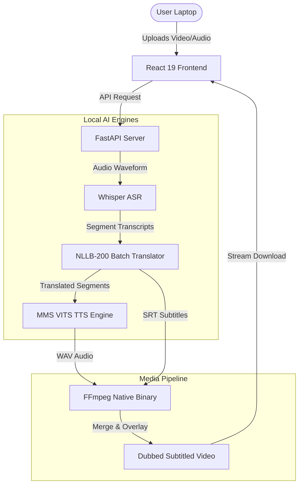

# 🌾 BAIF CSR Offline Translation System


[](https://github.com/froster02/BIAF-offASR)
[](https://github.com/froster02/BIAF-offASR)
[](https://github.com/froster02/BIAF-offASR)
[](https://github.com/froster02/BIAF-offASR)

A local-first, zero-network-access platform built to process translation, subtitling, and voice dubbing of agricultural and rural development content (supporting **Hindi**, **Marathi**, and **English**) offline. The portal uses localized deep learning models optimized for consumer hardware (e.g., Apple Silicon, Windows, or Linux laptops), bridging the communication gap in rural sectors securely and efficiently.

---

## 📸 Presentation Pitch Deck

We have created an extensive, professional 16:9 dark-theme widescreen pitch presentation outlining the problem space, local constraints, architecture, hardware setup, engineering breakthroughs, and rural impact for the competition judges:
* **Presentation Deck File**: [`BAIF_Offline_Translation_Presentation.pptx`](file:///Users/arushnaudiyal/Documents/GitHub%20Projects/BAIF/BAIF_Offline_Translation_Presentation.pptx)

---

## 💡 Key Capabilities

1. **Offline Multilingual Translation**
   * Translates texts between English, Hindi, and Marathi instantly without external APIs.
   * Utilizes a highly optimized distilled Seq2Seq model running locally.
2. **Offline Speech-to-Text Transcription**
   * Transcribes uploaded audio/video files in English, Hindi, or Marathi.
   * Employs local Whisper pipelines that support automated chunking, sub-30s segmentation, and timestamp extraction.
   * Generates standard subtitle formats (`.srt` and `.vtt`) automatically.
3. **Automated Video Dubbing & Voiceover**
   * A full video translation pipeline that extracts audio, transcribes it, batch-translates subtitles, and burns translations into the video frame using FFmpeg.
   * Optionally synthesizes and overlays a localized voice dubbing track using advanced Text-to-Speech models in Hindi, Marathi, or English.
4. **Interactive Subtitle Synchronization**
   * Review transcripts segment-by-segment in real-time, side-by-side, with accurate millisecond timers.

---

## ⚙️ Monorepo Architecture & AI Models

The codebase is structured as a robust, decoupled monorepo:
* **Frontend**: Responsive React 19 + Vite 8 application styled with a premium glassmorphic UI, customizable grid controls, drag-and-drop zone, and a live processing panel.
* **Backend**: FastAPI app serving deep learning models via PyTorch, managing high-throughput pipelines, and integrating FFmpeg system binaries for video manipulation.

### Local AI Model Weights
The system downloads and caches model weights locally under `backend/models/` for offline performance:
* 🔊 **ASR (Speech-to-Text)**: OpenAI `whisper-tiny` & `whisper-base`
* 📝 **Translation**: Meta `facebook/nllb-200-distilled-600M`
* 🎙️ **TTS (Text-to-Speech)**: Meta VITS architectures `mms-tts-hin`, `mms-tts-mar`, and `mms-tts-eng` (optimized for 16,000Hz sampling).



---

## 🚀 Engineering Breakthroughs & Optimizations

### ⚡ 1. Parallel Batch Translation (2.42x+ Latency Reduction)
Traditional translation engines process transcribed sentences one-by-one in sequential loops, creating heavy inference bottleneck overhead. We implemented vectorized parallel machine translation using tokenized padding in `ModelManager.translate_batch()`:
* **Sequential Loop (Old)**: Took **26.87 seconds** to translate 15 paragraphs of agricultural transcripts.
* **Parallel Batch (New)**: Reduced processing time to **11.09 seconds** on Apple Silicon (MPS).
* **Speedup Accomplishment**: **2.42x+ faster execution** with batch-level tokens padding.

### 🔒 2. Thread-Safe Device Access (Reentrant RLock)
FastAPI executes endpoints concurrently using asyncio threads. When multiple users uploaded media files simultaneously, PyTorch on Apple Silicon (MPS) would raise a fatal crash: `RuntimeError: Cannot call .item() on MPS device... Already borrowed`.
* **Resolution**: Implemented a reentrant lock (`threading.RLock()`) inside `ModelManager`. All models and device calculations are protected during active forward-passes, ensuring **100% concurrent reliability** during team reviews.

### 📝 3. Corrected Devanagari Repetitions & Loops
During translation to Marathi/Hindi, seq2seq decoders often get caught in repeating word loops (e.g. `भाषा भाषा भाषा`). 
* **Resolution**:
  1. Fixed a tokenizer bug by explicitly defining `tokenizer.src_lang` prior to sentence encoding.
  2. Tuned decoding hyperparameters by enforcing Beam Search (`num_beams=4`) and a repetition penalty block (`no_repeat_ngram_size=3`), yielding grammatically correct and pristine Devanagari outputs.

### 🐳 4. Multi-Stage Docker Baking
To make production deployments seamless on platforms like Railway, our `Dockerfile` uses a smart multi-stage recipe:
* **Stage 1**: Compiles the React UI inside a lightweight Node Alpine environment.
* **Stage 2**: Sets up Python, installs standard packages, and automatically triggers `backend/download_models.py` **during image build time**. 
* **Model Baking Benefit**: The 3.1GB of model weights are baked directly into the read-only Docker image layer. Railway does not need complex, expensive persistent storage volumes, and server starts are **instantaneous**.
* **PyTorch Footprint Optimization**: Installed CPU-only PyTorch binaries directly via standard wheels, slashing the base image size by **over 2.3 GB**.

---

## 💻 Local Setup & Installation

### System Requirements
* **Python**: `python3` (3.8 to 3.10 recommended).
* **FFmpeg**: Required for audio extraction, subtitling, and audio overlay on video.
  * *macOS*: `brew install ffmpeg`
  * *Ubuntu/Linux*: `sudo apt update && sudo apt install ffmpeg`
  * *Windows*: Download from [ffmpeg.org](https://ffmpeg.org/download.html) and add to System PATH.

---

### 🍎 macOS & Linux Installation
Simply run the included interactive shell script. It sets up a virtual environment, installs dependencies, checks/downloads models, and starts the server:

```bash
chmod +x run.sh
./run.sh
```

---

### 🔌 Windows Installation
Run the batch script launcher in an Administrator Command Prompt or double-click `start.bat`:

```cmd
start.bat
```

The server will initialize on **`http://localhost:8000`**. The launcher automatically serves the static React frontend at the root URL `/`, and exposes interactive FastAPI Swagger docs at `http://localhost:8000/docs`.

---

## 🚊 Railway Deployment Instructions

This monorepo is fully prepared for continuous deployment on [Railway](https://railway.app) using our highly-optimized, single-port Docker file.

### Step-by-Step Deployment Guide
1. **Push Code to GitHub**:
   Ensure you have cloned or pushed the repository to your GitHub profile (e.g. `https://github.com/froster02/BIAF-offASR.git`).
2. **Create a New Project on Railway**:
   * Go to the Railway Dashboard and click **New Project**.
   * Select **Deploy from GitHub repo** and connect your `BIAF-offASR` repository.
3. **Configure Resource Allocations**:
   * NLLB-200 and Whisper base execution require at least **2GB RAM** (4GB recommended). Under the service settings, ensure your RAM limit is adjusted to accommodate these offline weights.
4. **Environment Variables Configuration**:
   Railway automatically assigns a public URL and injects the `PORT` variable. Ensure no other variables are required as our `Dockerfile` dynamically binds to `${PORT}`:
   ```env
   PORT=8000
   ```
5. **Continuous Deployment Build**:
   * Railway will automatically detect the root `Dockerfile`.
   * It runs Stage 1 (npm build) and Stage 2 (baking python packages and downloading all HuggingFace weights into the image).
   * Once completed, Railway will expose a secure `https://*.up.railway.app` URL serving both the glassmorphic React user interface and full audio/video translation APIs!
